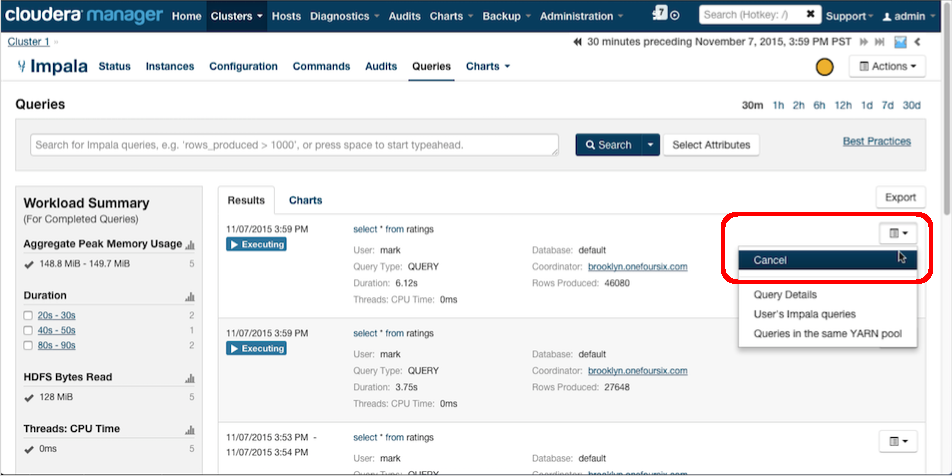

kill-long-running-impala-queries
====================

Cloudera Manager's Impala Queries page allows Impala queries to be monitored, managed and cancelled (killed) as desired:

This script provides an example of using Cloudera Manager's Python API Client to programmatically list and/or kill Impala queries that have been running longer than a user-defined time. It may be useful in shops where poorly formed queries run for too long and consume too many cluster resources and an automated solution for killing such queries is desired.

Info on the CM API is [here](http://cloudera.github.io/cm_api/)

####Requirements
- Cloudera Manager 5.2 or higher (I tested with CM 5.4.8)  
- CDH 5.2 or higher (I tested with CDH 5.4.8)
- The version of the CM API that matches your CM version
- A CM login with "Full Administrator" role is currently required to kill Impala queries
- Python 2.6+

####Install the Cloudera Manager API 
Download the version of the CM API that matches the version of Cloudera Manager you are using. Consult the chart [here](http://cloudera.github.io/cm_api/docs/releases/) to see what version of the the API you will need to install

####Usage: 
    ./killLongRunningImpalaQueries.py  queryRunningSeconds [KILL]

Set <code>queryRunningSeconds</code> to the threshold considered "too long" for an Impala query to run, so that queries that have been running longer than that will be identifed as queries to be killed

The second argument <code>KILL</code> is optional.
Without this argument, a list of queries that are identified as running too long will be printed to the console, but no queries will be killed. 
If the argument <code>KILL</code> is provided, a cancel command will be issued for each query identified as running too long. 
See [here](http://www.cloudera.com/content/www/en-us/documentation/enterprise/latest/topics/cm_dg_impala_queries.html) for info on cancelling Impala queries.

Make sure to also set the CM URL, Cluster Name, login and password in the settings within the script

CM versions <= 5.4 require Full Administrator role to cancel Impala queries 

Set the CM URL, Cluster Name, login and password in the settings below

This script assumes there is only a single Impala service per cluster

Here is an example with an artificially low query running time (30 seconds) used just as a demonstration:

List queries that have run for more than 30 seconds:

    ./killLongRunningImpalaQueries.py  30 

    Connecting to Cloudera Manager at toronto.onefoursix.com:7180
    Located Impala Service: impala
    Looking for Impala queries running more than 30 seconds
    -- long running queries -------------
    queryState : CREATED
    queryId: 5d4065b64f0faeb8:eec9dd65071c3c8a
    user: mark
    startTime: 2015-11-07 23:38:55 
    query running time (seconds): 77
    SQL: select * from ratings
    -------------------------------------
    queryState : CREATED
    queryId: cf44fa531c01e450:19a74a9d0a2a8eb5
    user: mark
    startTime: 2015-11-07 23:38:57 
    query running time (seconds): 75
    SQL: select * from ratings
    -------------------------------------
    queryState : CREATED
    queryId: 214af012c6e2bf39:7f8e7a888f03888c
    user: mark
    startTime: 2015-11-07 23:39:40 
    query running time (seconds): 32
    SQL: select * from ratings
    -------------------------------------
    done

Kill queries that have run for more than 30 seconds:

    $ ./killLongRunningImpalaQueries.py  30 KILL

    Connecting to Cloudera Manager at toronto.onefoursix.com:7180
    Located Impala Service: impala
    Looking for Impala queries running more than 30 seconds
    Queries will be killed
    -- long running queries -------------
    queryState : CREATED
    queryId: 5d4065b64f0faeb8:eec9dd65071c3c8a
    user: mark
    startTime: 2015-11-07 23:38:55 
    query running time (seconds): 87
    SQL: select * from ratings
    Attempting to kill query...
    -------------------------------------
    queryState : CREATED
    queryId: cf44fa531c01e450:19a74a9d0a2a8eb5
    user: mark
    startTime: 2015-11-07 23:38:57 
    query running time (seconds): 85
    SQL: select * from ratings
    Attempting to kill query...
    -------------------------------------
    queryState : CREATED
    queryId: 214af012c6e2bf39:7f8e7a888f03888c
    user: mark
    startTime: 2015-11-07 23:39:40 
    query running time (seconds): 42
    SQL: select * from ratings
    Attempting to kill query...
    -------------------------------------
    done

